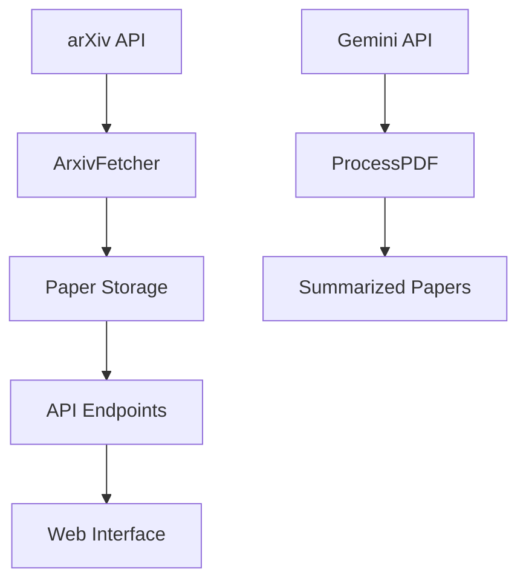

# AI Daily Documentation

Welcome to the AI Daily documentation. This document provides comprehensive information about the project's architecture, API endpoints, and development guidelines.

## Table of Contents

- [Architecture](#architecture)
- [API Reference](#api-reference)
- [Development Guide](#development-guide)
- [Deployment](#deployment)

## Architecture

AI Daily follows a clean architecture pattern with the following components:

### Core Components

1. **Data Layer**: JSON files stored in the `data/` directory
2. **Service Layer**: Business logic for fetching papers, processing PDFs, and generating summaries
3. **API Layer**: FastAPI routes that expose functionality via REST endpoints
4. **Presentation Layer**: Web interface for user interaction

### Data Flow



## API Reference

All API endpoints are prefixed with `/ai-daily/v1`.

### Health Check

```
GET /health
```

Returns the status of the application and the number of cached papers.

### Fetch and Store Paper

```
POST /fetch_store
```

Fetches a random paper from arXiv and stores it locally.

### Get Today's Papers

```
GET /today
```

Retrieves papers fetched today.

### Summarize Paper

```
POST /summarize
```

Generates a structured summary for a paper using the Gemini API.

Body:
```json
{
  "api_key": "your_gemini_api_key",
  "paper_id": "paper_identifier"
}
```

### Get Specific Paper

```
GET /paper/{paper_id}
```

Retrieves a specific paper by its ID.

### Get Paper History

```
GET /history
```

Retrieves paper history with optional date range filtering.

Query Parameters:
- `date_range`: Filter by date range (7, 30, or "all")

## Development Guide

### Setting Up the Development Environment

1. Install Python 3.12+
2. Install uv: `pip install uv`
3. Install dependencies: `uv sync`
4. Copy `.env.example` to `.env` and add your API key

### Code Structure

- `AIDaily/constants/`: Application constants
- `AIDaily/routes/`: API route definitions
- `AIDaily/schemas/`: Pydantic data models
- `AIDaily/services/`: Business logic
- `AIDaily/static/`: Static assets
- `AIDaily/templates/`: HTML templates
- `utils/`: Utility functions

### Running Tests

```bash
uv run pytest
```

### Code Quality

```bash
# Check for issues
uv run ruff check .

# Auto-fix issues
uv run ruff check . --fix

# Format code
uv run ruff format .
```

## Deployment

### Local Deployment

1. Follow the setup instructions in the README
2. Run the application: `uv run python -m AIDaily.main`
3. Access the web interface at `http://localhost:8000`

### Production Deployment

For production deployment, consider using:

1. A production WSGI server like Gunicorn
2. A reverse proxy like Nginx
3. Environment-specific configuration
4. Proper logging and monitoring

Example with Gunicorn:
```bash
gunicorn -w 4 -k uvicorn.workers.UvicornWorker AIDaily.main:app
```